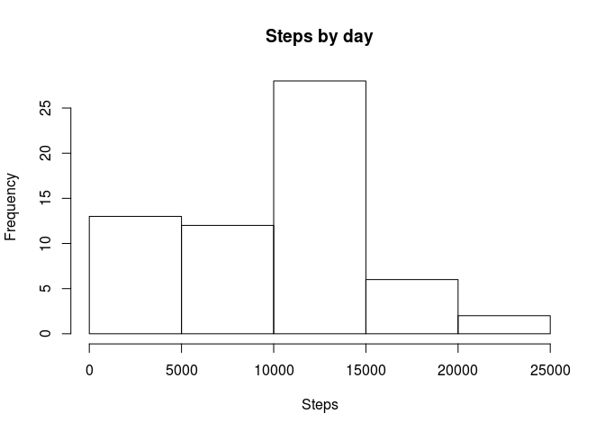

# Reproducible Research: Peer Assessment 1


## Loading and preprocessing the data


```r
con <- unz("activity.zip", "activity.csv")
data <- read.csv(con)
```

## What is mean total number of steps taken per day?


```r
stepsByDay <- aggregate(steps ~ date, data, sum)

hist(stepsByDay$steps, xlab="Steps")
```



```r
sprintf("Mean amount of steps: %.2f", mean(stepsByDay$steps))
```

```
## [1] "Mean amount of steps: 10766.19"
```

```r
sprintf("Median amount of steps: %d", median(stepsByDay$steps))
```

```
## [1] "Median amount of steps: 10765"
```


## What is the average daily activity pattern?


## Imputing missing values


## Are there differences in activity patterns between weekdays and weekends?
