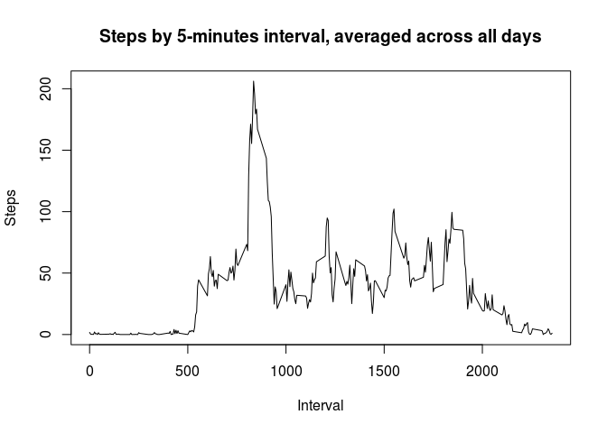
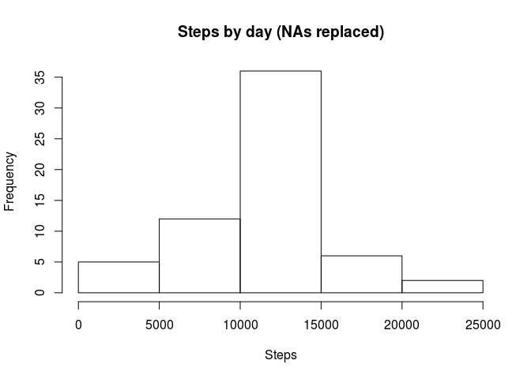
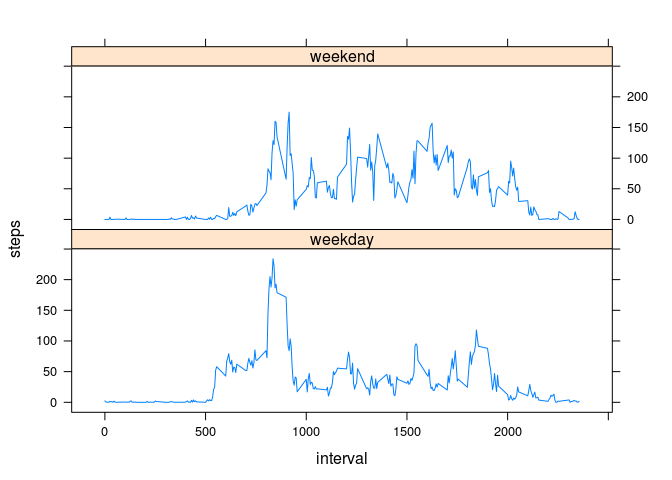

# Reproducible Research: Peer Assessment 1


## Loading and preprocessing the data


```r
con <- unz("activity.zip", "activity.csv")
data <- read.csv(con)
```

## What is mean total number of steps taken per day?


```r
stepsByDay <- aggregate(steps ~ date, data, sum)

hist(stepsByDay$steps, xlab="Steps", main="Steps by day")
```


```r
sprintf("Mean amount of steps: %.2f", mean(stepsByDay$steps))
```

```
## [1] "Mean amount of steps: 10766.19"
```

```r
sprintf("Median amount of steps: %d", median(stepsByDay$steps))
```

```
## [1] "Median amount of steps: 10765"
```


## What is the average daily activity pattern?


```r
stepsByInterval <- aggregate(steps ~ interval, data, mean)

plot(stepsByInterval$interval, stepsByInterval$steps, type="l", xlab="Interval", ylab="Steps", main="Steps by 5-minutes interval, averaged across all days")
```



```r
maxNumberOfSteps <- max(stepsByInterval$steps)

sprintf("Interval %d contains maximum number of steps: %.2f", with(stepsByInterval, subset(interval, steps==maxNumberOfSteps)), maxNumberOfSteps)
```

```
## [1] "Interval 835 contains maximum number of steps: 206.17"
```


## Imputing missing values


```r
sprintf("%d values are missing from the data set", sum(is.na(data$steps)))
```

```
## [1] "2304 values are missing from the data set"
```

Let us use the rounded mean value for the current interval as a substitute for missing data.


```r
dataJoined <- merge(data, stepsByInterval, by="interval")

dataNoNAs <- within(dataJoined, steps <- ifelse(is.na(steps.x), round(steps.y), steps.x))

stepsByDayNoNAs <- aggregate(steps ~ date, dataNoNAs, sum)

hist(stepsByDayNoNAs$steps, xlab="Steps", main="Steps by day (NAs replaced)")
```



```r
sprintf("Mean amount of steps (NAs replaced): %.2f", mean(stepsByDayNoNAs$steps))
```

```
## [1] "Mean amount of steps (NAs replaced): 10765.64"
```

```r
sprintf("Median amount of steps (NAs replaced): %d", median(stepsByDayNoNAs$steps))
```

```
## [1] "Median amount of steps (NAs replaced): 10762"
```

As the result of substituting the missing data with the rounded mean values of the intervals, the mean and median daily amount of steps went slightly down, though by less then 0.1%.

## Are there differences in activity patterns between weekdays and weekends?


```r
data <- transform(data, weekend = factor(as.POSIXlt(date)$wday %in% c(0,6), labels=c("Weekday","Weekend")))

splitData <- lapply(split(data, data$weekend), function(chunk){aggregate(steps ~ interval, chunk, mean)})

weekdayData <- splitData$Weekday
weekendData <- splitData$Weekend

weekdayData$weekday="weekday"
weekendData$weekday="weekend"

stepsBydayWithWeekends <- rbind(weekdayData, weekendData)

library(lattice)
xyplot(steps ~ interval | weekday, stepsBydayWithWeekends, type="l", layout=c(1,2))
```


